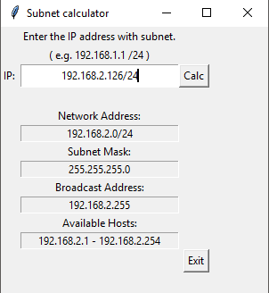

# SubnetCalculator

README.TXT

Made with Python 3.4.3. (Should be possible to build and run it in Linux with Python IDLE [idle3])
GUI is made with Tkinter.

After launching the program, a window appears: it wants an input.
Enter IP/mask. For example '192.168.0.2 /24'.

After entering your input and pressing 'calc' the program shows you

- IP-address you wrote.
- Subnet mask.
- Network address.
- Broadcast address.
- Available hosts.

In error situations you'll get a text 'Unexpected error. Please, check your input.'
Usually this is due an invalid IPv4 address or input error(typo).

You can keep inserting IPv4 addresses and pressing 'calc' and the program will calculate proper values every time.

